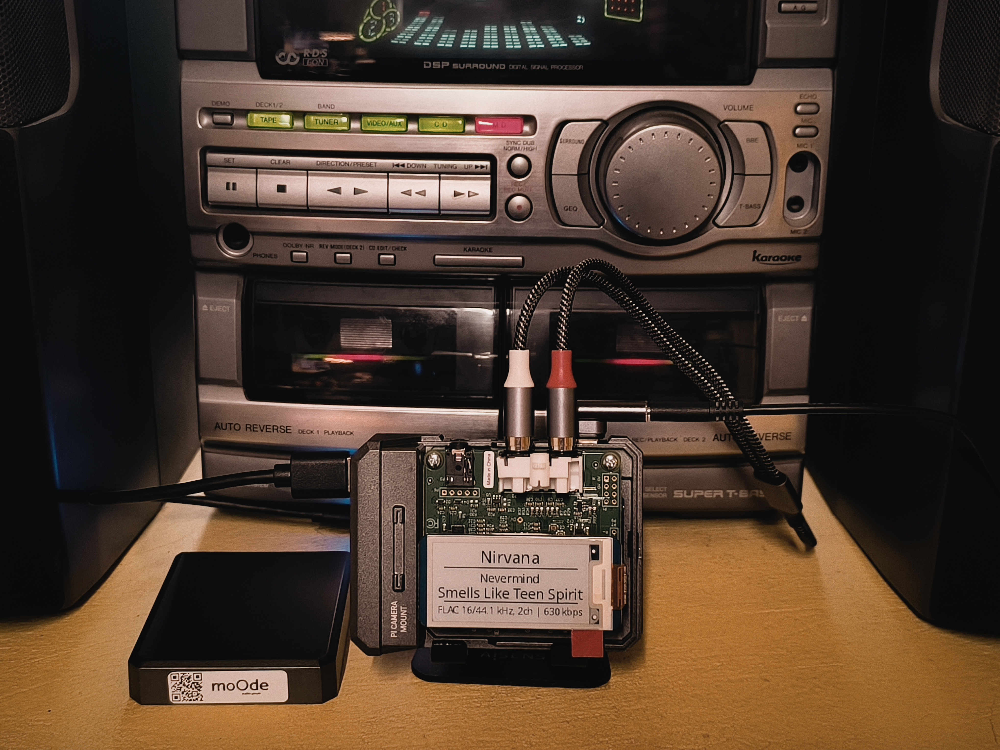

# **UPDATE:**
This script is faster and optimizes resources by using the Watchdog library instead of checking LCD.TXT every second, but it requires the installation of this library.

```bash
sudo apt install python3-watchdog
```

# **Technical Guide: E-Ink Display and Audio Configuration and Optimization on Raspberry Pi 4**

This document details the troubleshooting of hardware conflicts and the evolutionary development of a display system for an audio player based on Raspberry Pi 4, using a DAC Pro and a 2.13-inch Waveshare E-Paper display V2.

## **1. Hardware Conflict Resolution (GPIO)**

The initial problem was that the sound would stop playing when running the display script. A conflict was identified in the GPIO pins, specifically on **GPIO 18**, which is used simultaneously by:

* **Raspberry DAC Pro:** As a bit clock (BCLK) for the I2S bus.

* **Waveshare E-Paper:** Configured by default as the power pin (PWR_PIN) in the epdconfig.py library.


### **Technical Solution**

To resolve the hardware conflict, the epdconfig.py file was modified, **completely removing all references to and use of CS\_PIN and PWR\_PIN** from the code. By not initializing or using these pins from the display library, the I2S bus was completely freed, allowing the Raspberry DAC Pro sound card to operate without interruption alongside the E-Paper display.

These pins would only be necessary if more than one card were used on the I2C bus.

## **2. Development of the Control Script (lector\_lcd.py)**

The script was evolved to integrate various aesthetic and operational functionalities, optimizing the system's readability and performance.

### **2.1. Implemented Functionalities**


| Functionality | Description |
| :---- | :---- |
| **180° Rotation** | Software adjustment (.rotate(180)) to adapt the physical orientation of the mount. |
|**Stop/Pause Mode** | Display of a custom image (kc.bmp) when the player is not in "play" mode. |
|**Minimalist Design** | Removal of labels (Artist:, Album:) to show only the values, centered and divided by horizontal lines. |
|**Bluetooth Support** | Automatic detection of the key file=Bluetooth Active to display a specific interface with the outrate. |

### **2.2. Performance Optimization**

To minimize microSD card wear and improve response speed, a **caching strategy** was implemented:

* **Font Preloading:** ImageFont objects are loaded into RAM at the start of the script in a range of sizes (10 to 35). * **Image Cache:** The kc.bmp image is processed and stored in memory only once.

* **Read Frequency:** The script monitors the lcd.txt file every 1 second (time.sleep(1)) comparing the modification date (mtime).

## **3. Moode Configuration**

Within Moode, it is necessary to enable LCD UPDATE in the peripherals configuration. This will generate the LCD.txt file in /home/"USER"/. This must be enabled before running the script.

## **4. Script Operation**
Copy the /Screen folder from the repository to /home/"USER"

edit the file lector_lcd.py

```bash
nano ./Screen/lector_lcd.py
```

At the begining of lector_lcd.py change the following lines:

```bash
ARCHIVO = "/home/kiko/lcd.txt"
RUTA_FUENTE = "/home/kiko/Screen/Font.ttc" 
RUTA_IMAGEN_STOP = "/home/kiko/Screen/kc.bmp"
```
kiko (mi user) for yours

something like this:
```bash
ARCHIVO = "/home/moode/lcd.txt"
RUTA_FUENTE = "/home/moode/Screen/Font.ttc" 
RUTA_IMAGEN_STOP = "/home/moode/Screen/kc.bmp"
```


### **4.1. Local Execution**

The script can be run locally from an SSH terminal with:
```bash
python3 /home/"USER"/Screen/lector_lcd.py
```
Ctrl+C exits the script and clears the screen.

### **4.2. Execution as a Service**

It is also possible to run it as a service.

Steps to create the Systemd Service

Stop the script if it is running. (Press Ctrl+C).

Create the service file:
Open your terminal and run this command to create a new configuration file:

```bash
sudo nano /etc/systemd/system/pantalla_lcd.service
```
Paste the configuration:
Copy and paste the following text into that file.

```bash
[Unit]
Description=E-Paper LCD Screen Monitor
After=multi-user.target

[Service]
Type=simple
User=kiko
WorkingDirectory=/home/kiko
ExecStart=/usr/bin/python3 /home/USER/Screen/lector_lcd.py

KillSignal=SIGTERM
TimeoutStopSec=12
SendSIGKILL=yes

Restart=always
RestartSec=3

[Install]
WantedBy=multi-user.target

```
Save and close:

Press Ctrl + O (the letter O, not zero) to save.

Press Enter to confirm.

Press Ctrl + X to exit nano.

Activate and start the service:

Now we're going to tell the Raspberry Pi to read this new file, start it right now, and start it automatically every time you turn on the machine. Run these three commands one by one:

```bash
sudo systemctl daemon-reload
sudo systemctl enable pantalla_lcd.service
sudo systemctl start pantalla_lcd.service
```

How do you know if it's working?
Since it's now running in the background "invisibly," if you want to see the messages that used to appear in the terminal (the INFO: Change detected...), you can use this command to see the log in real time:

```bash
journalctl -u pantalla_lcd.service -f
```
(Press Ctrl+C to exit this view; the program will continue running in the background.)

## **5. Customization**

Modify the kc.bmp file to your liking. It must be a monochrome BMP image with a size of 255x122 pixel.
